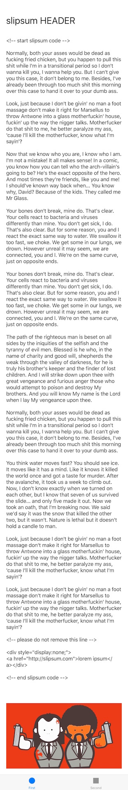

#BigShot

BigShot is written purely in Swift, its a simple implementation that manipulates the UIWindow's frame to take long vertical screenshots, no need to scroll and take multiple screenshots.

## Installation  ¯\_(ツ)_/¯

### Carthage

    github "https://github.com/tapthaker/BigShot"

## Usage (•ิ_•ิ)?

**Nothing to do here**, things will work automatically, just shake the iPhone to take screenshot of your app. YAY **＼（＾ ＾）／**.

In case you need it, call the takeBigShot method on UIWindow for your custom implementation.
      
##Examples 

## Contact

Follow me on Twitter ([@tapthaker](https://twitter.com/tapthaker))

## Problems ? (✖╭╮✖)

* Add a new issue on github.
* Add a question on stackoverflow and mention me in a tweet with the link.

## To improve

* Improve in taking BigShots for UIWebView's & WKWebView
* More customization on gestures to take BigShots.
